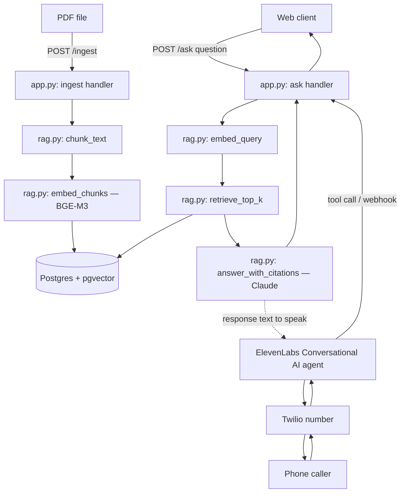

# Architecture — voice-rag-agent (v1 scaffold)

This document describes the intended data flow and component responsibilities. It reflects the target design of this scaffold; where the current code is a stub or TODO, that is called out explicitly — see [README.md](README.md#demo-scope--roadmap--whats-real-vs-what-a-demo-simplification) for the honest real-vs-demo split.

## Flow

## Components

### `src/app.py` — FastAPI service

Owns HTTP concerns only: request/response models, validation, wiring the two endpoints to `src/rag.py`. It does not itself know how embeddings or retrieval work — that logic lives in `rag.py` so it can be unit-tested and reused by both the web and voice front doors.

- `POST /ingest` — accepts a PDF upload, calls the ingestion pipeline (chunk -> embed -> store), returns a document ID and chunk count.
- `POST /ask` — accepts `{"question": str, "document_id": str | None}`, calls the retrieval + answer pipeline, returns `{"answer": str, "citations": [...]}`.
- Both endpoints validate input (empty question, oversized file, wrong content-type) and return structured error responses rather than leaking stack traces.

### `src/rag.py` — retrieval-augmented generation core

The single place that knows what "grounded" means. Shared by both front doors.

- `chunk_text(text, chunk_size, overlap) -> list[Chunk]` — pure function, splits raw extracted PDF text into overlapping chunks with page metadata. This is the one function this v1 scaffold unit-tests directly (see `tests/test_rag.py`), because it has no external dependencies (no network, no DB) and is the cheapest place to catch regressions.
- `embed_chunks(chunks) -> list[EmbeddedChunk]` — calls the BGE-M3 embedding model (local or hosted) for each chunk. TODO in v1: wire the actual model client.
- `embed_query(question) -> Vector` — same embedding call, applied to the user's question.
- `retrieve_top_k(query_vector, k) -> list[EmbeddedChunk]` — runs a pgvector cosine-distance query against stored chunks. TODO in v1: wire the actual SQL/ORM query.
- `answer_with_citations(question, retrieved_chunks) -> Answer` — builds a grounded prompt (retrieved chunks + question), calls Claude, and returns the answer plus the page numbers it drew from. Instructed to decline rather than guess when retrieved context doesn't answer the question.

### Postgres + pgvector

Stores chunks as rows: `(id, document_id, page_number, text, embedding vector(1024))`. A single table is enough for v1 (one document at a time, no per-tenant isolation — see the roadmap in the README).

### ElevenLabs Conversational AI + Twilio (voice front door)

- A Twilio phone number is configured to forward incoming calls to an ElevenLabs Conversational AI agent.
- The ElevenLabs agent is configured with a custom tool that calls this service's `/ask` endpoint mid-conversation, passing the caller's spoken question (already transcribed by ElevenLabs) and speaking back the returned answer.
- This service does not manage the phone call's audio/session state — that is entirely ElevenLabs' and Twilio's responsibility. This service is a stateless retrieval-and-answer tool called over HTTP.

## What is explicitly out of scope for v1

See the README's "Demo scope / roadmap" section — multi-tenant isolation, auth, call analytics, streaming responses, and production-grade retry/observability are deliberately not attempted here.
