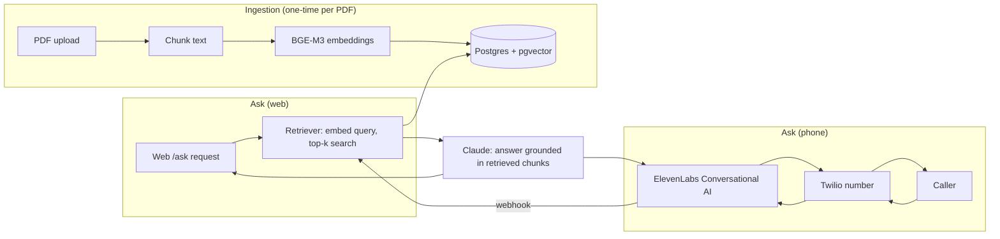

   

# voice-rag-agent — ask a PDF by phone or web

> Built by [Luis Monsalve](https://novaiflow.com) · NovAIFlow — Applied AI Engineer (Voice Agents · RAG · MCP)

Upload a PDF. Ask it questions — by typing them into a web form, or by calling a phone number and asking out loud. Either way, the answer is grounded in the document, with page citations, not a hallucinated guess.

**Why this exists:** most public RAG demos stop at a chat box. Most public voice-agent demos stop at "the AI can talk." This scaffold wires both halves together over one shared retrieval core, because that's the shape production voice-support systems actually take: one knowledge base, multiple front doors.

## How it works



- **Ingestion** happens once per document: the PDF is chunked, each chunk is embedded with BGE-M3, and the vectors land in a `pgvector` column alongside the source text and page number.
- **Web asks** hit `/ask` directly and get a JSON answer with citations back synchronously.
- **Phone asks** go through Twilio to an ElevenLabs Conversational AI agent, which calls this service's webhook mid-call to fetch a grounded answer, then speaks it back.
- Both paths share the same retrieval + Claude-answering code in `src/rag.py` — there is exactly one place that decides what "grounded" means.

## Features

- PDF ingestion endpoint: upload -> chunk -> embed (BGE-M3) -> store in pgvector.
- Text Q&A endpoint (`/ask`) for the web front door, with page-level citations.
- Voice front door: Twilio number + ElevenLabs Conversational AI agent configured to call this service as a retrieval tool mid-call.
- Answers are grounded — the LLM is instructed to answer only from retrieved chunks and to say when it doesn't know.
- Single shared retrieval core (`src/rag.py`) for both front doors — no duplicated RAG logic.

## Quickstart

```bash
git clone https://github.com/luissalve/voice-rag-agent
cd voice-rag-agent
cp .env.example .env        # fill in real keys — see table below
pip install -e .
uvicorn src.app:app --reload
```

Then:

```bash
# 1. ingest a PDF
curl -X POST http://localhost:8000/ingest -F "file=@sample.pdf"

# 2. ask it a question over text
curl -X POST http://localhost:8000/ask -H "Content-Type: application/json" \
  -d '{"question": "What does section 2 say about refunds?"}'
```

The phone front door additionally requires a Twilio number pointed at an ElevenLabs Conversational AI agent, and that agent configured to call this service's `/ask` endpoint as a custom tool during the conversation. See [ARCHITECTURE.md](ARCHITECTURE.md) for the wiring.

## Environment variables

| Variable | Required | Description |
|---|---|---|
| `ANTHROPIC_API_KEY` | yes | Claude API key — used to generate grounded answers |
| `DATABASE_URL` | yes | Postgres connection string, `pgvector` extension enabled |
| `EMBEDDING_MODEL` | no (default `BAAI/bge-m3`) | Embedding model identifier |
| `ELEVENLABS_API_KEY` | yes for voice | ElevenLabs API key |
| `ELEVENLABS_AGENT_ID` | yes for voice | Conversational AI agent ID that fronts the phone calls |
| `TWILIO_ACCOUNT_SID` | yes for voice | Twilio account SID |
| `TWILIO_AUTH_TOKEN` | yes for voice | Twilio auth token |
| `TWILIO_PHONE_NUMBER` | yes for voice | The number callers dial |
| `APP_ENV` | no (default `development`) | `development` \| `production` |

Copy `.env.example` to `.env` and fill in real values — never commit `.env`.

## Demo scope / roadmap — what's real vs. what's a demo simplification

This is a **v1 scaffold**, built to prove the architecture end to end, not a hardened product. Honestly:

**Real and working (or wired for a real integration point) in this repo:**
- FastAPI service with typed `/ingest` and `/ask` endpoints.
- A real chunking + embedding + pgvector retrieval flow in `src/rag.py`.
- A defined contract for the ElevenLabs <-> Twilio <-> webhook voice path.

**Out of scope for v1 — explicitly not attempted here:**
- Multi-document corpora / multi-tenant isolation (one PDF, one knowledge base, no per-tenant RLS — see the `multi-tenant-rls` pattern in [`ai-engineering-cookbook`](https://github.com/luissalve/ai-engineering-cookbook) for that pattern in isolation).
- Call recording, transcript storage, or analytics.
- Authentication/authorization on the API (demo assumes a trusted local/dev caller).
- Production-grade error retry, rate limiting, and observability (see `ai-engineering-cookbook`'s `observability` recipe for that pattern).
- Streaming token-by-token responses.

A production version of this pattern (multi-tenant, authenticated, observable) has been built for a client under NDA — ask for a live walkthrough in an interview.

## Tests

```bash
pip install -e ".[dev]"
pytest
```

One real unit test currently covers the pure text-chunking helper in `src/rag.py`. This is a starting point, not a coverage claim — see the roadmap above for what's not yet tested (API endpoints, retrieval against a live database, the voice webhook path).

## Tech stack

| Layer | Choice |
|---|---|
| API | FastAPI |
| LLM | Anthropic Claude |
| Embeddings | BGE-M3 |
| Vector store | Postgres + pgvector |
| Voice | ElevenLabs Conversational AI |
| Telephony | Twilio |
| Packaging | `pyproject.toml` / pip |

## License

MIT — see [LICENSE](LICENSE).
